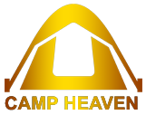
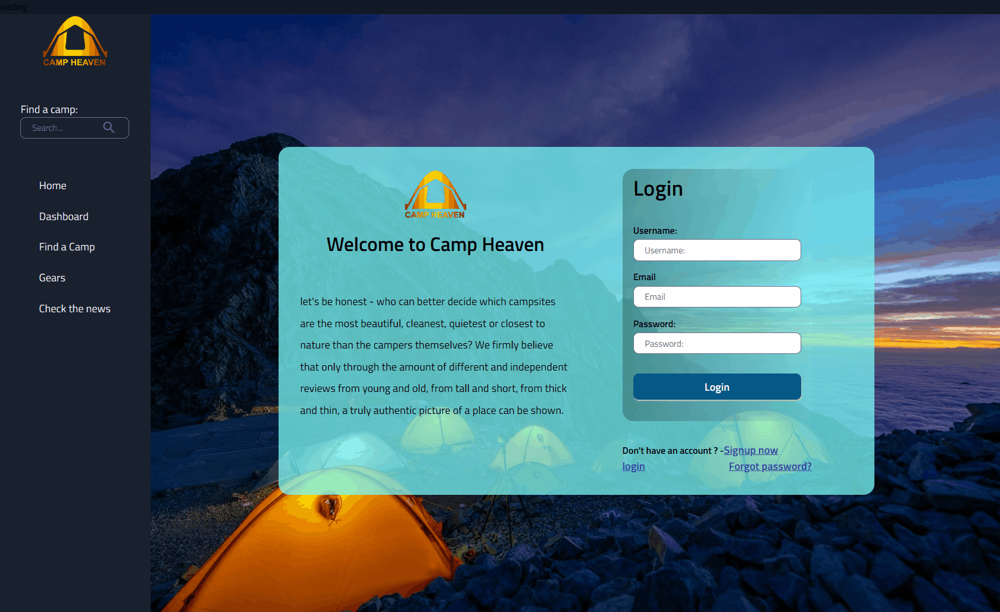
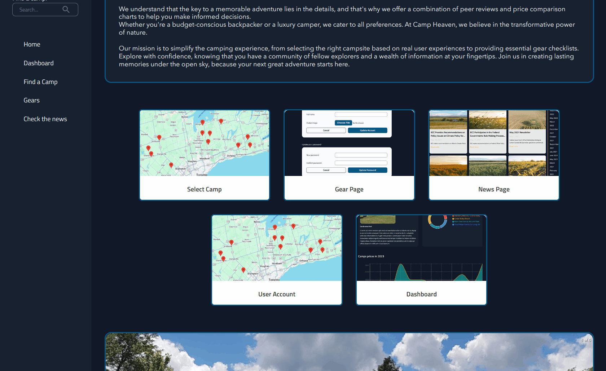
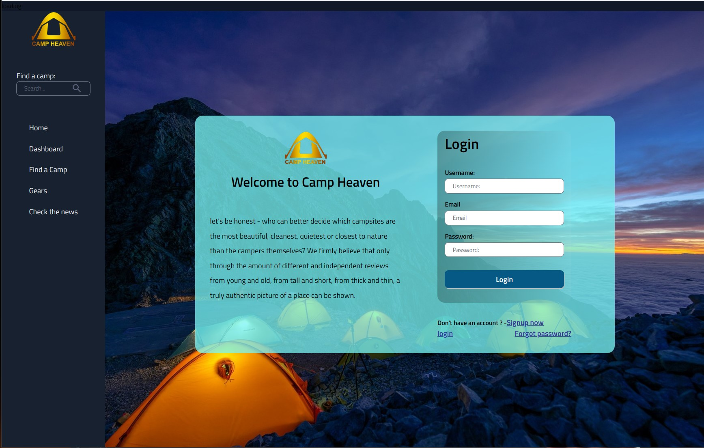
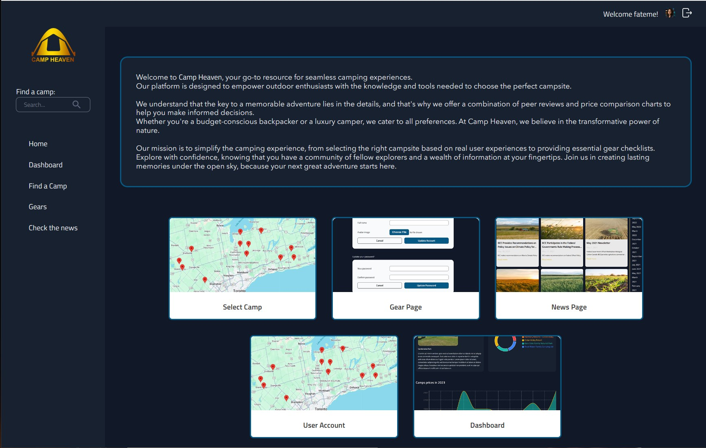
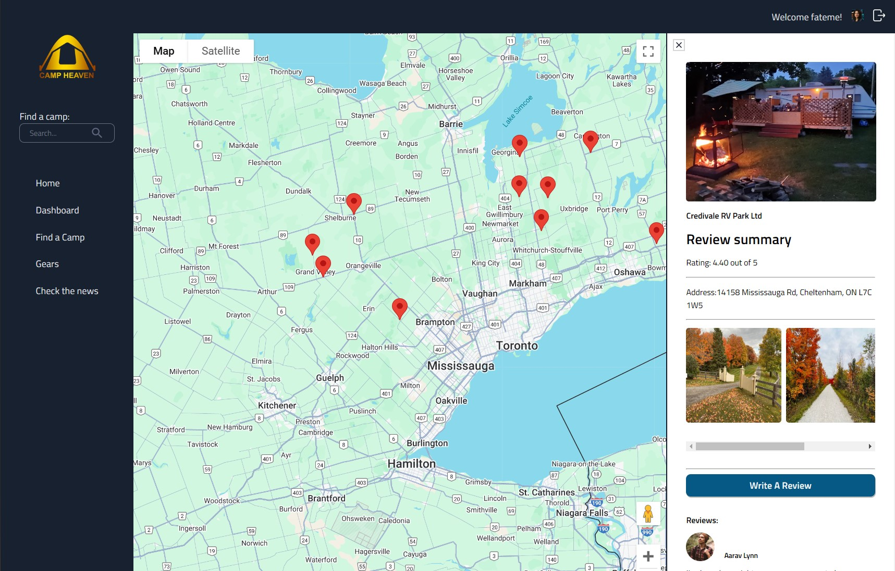
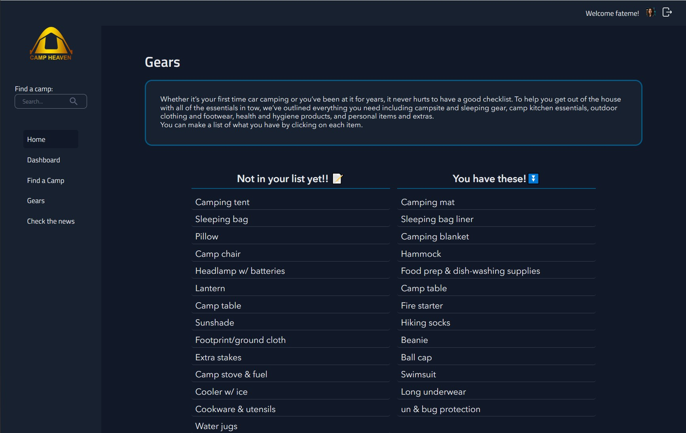
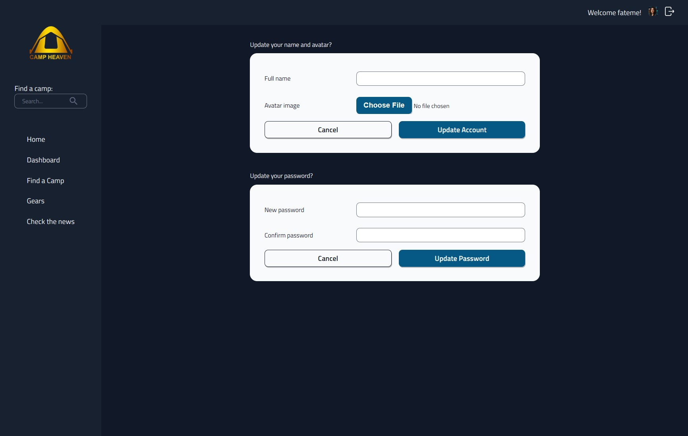
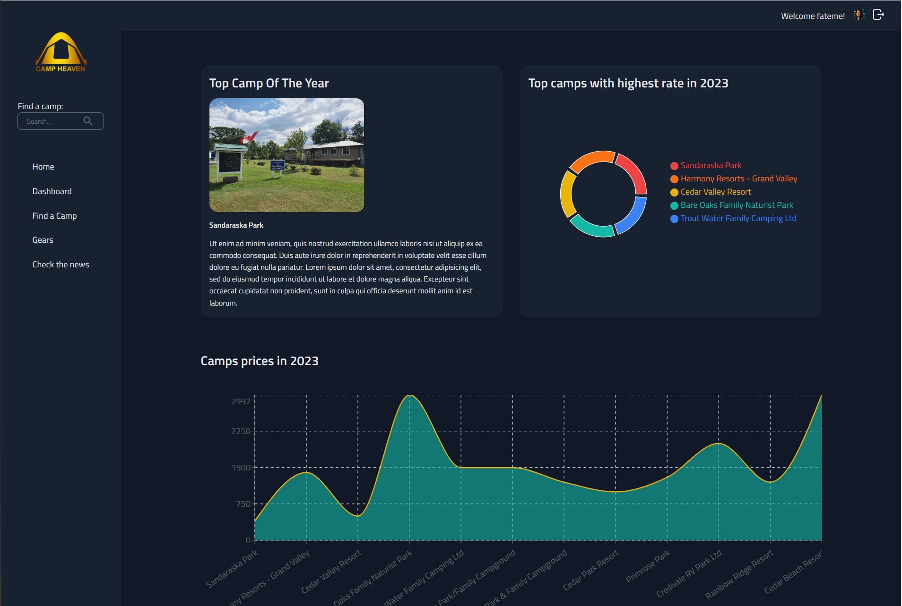

# Camp Heaven 

# My Capstone project to practice React MySQL Node

## Live Demo

Check out the live demo of Camp Heaven: [Live Demo on Netlify](<(https://fateme-camp-heaven.netlify.app)>)

## Project Overview

**Camp Heaven** is a web application designed to enhance the camping experience for users by providing essential tools for camp selection, gear management, and more. The platform allows users to explore various camps, track their camping gear, stay informed with the latest news, and manage their own personalized camping dashboard.

## Animated Demo






## Features

- **Camp Selection:** Explore various camps and navigate to dedicated pages with more details.
- **Gear Management:** Organize your camping equipment and ensure you have everything needed for your trips.
- **Camping News:** Stay updated with the latest news and trends in the camping and outdoor world.
- **User Profile & Dashboard:** Manage your user account and view a summary of your camping plans.

## Technologies Used

### Frontend

- **React**: User interface components and state management.
- **React Router**: Navigation between pages.
- **Sass**: For styling and responsive design.
- **Recharts**: Visual charts for dashboard metrics.
- **Axios**: API requests.

### Backend

- **Node.js & Express**: RESTful API services.
- **MySQL**: Database for storing user, camp, and gear information.
- **Knex.js**: SQL query builder for database interactions.
- **Passport**: Authentication and user management.
- **Stripe**: Payment processing.

## Screenshots

## login page



## Home page



## Camp page



## Gear page



## Account Page



## Dashboard



## Acknowledgements

- **React Team** for building a powerful UI library.
- **Vite** for fast development builds.
- **Knex.js** and **MySQL** for a reliable database setup.
- **Community Contributors** for providing valuable tools and resources that made this project possible.

## How to View the Project Locally

1. **Clone the repository**:
   ```bash
   git clone https://github.com/FatemeBagherzad/camp-heaven.git
   ```
2. Navigate into the project directory for both Client and Server in two terminal:

   ```bash
   cd camp-heaven/server
   ```

3. Create the MySQL database: Open your MySQL terminal and create a new database named campheaven:

   ```bash
   CREATE DATABASE campheaven;
   ```

4. Run the migrations and seeds:

   ```bash
   npx knex migrate:latest
   npx knex seed:run
   ```

5. Start the server::

   ```bash
   npm start
   ```

6. Navigate to the client directory in another terminal:

```bash
cd ../client-camp-heaven
```

7. Start the development server:

```bash
npm run dev
```

8. Open your browser and go to http://localhost:5173 to view the application.

## What I Learned

Throughout the development of Camp Heaven, I gained valuable experience in:

- Building a full-stack application using React and Node.js.
- Handling complex state management and component communication in React.
- Creating secure authentication flows with Passport and managing tokens.
- Designing responsive layouts and custom components using Sass.
- Integrating third-party services like Stripe for payment processing.
- Managing a MySQL database with Knex.js for migrations and queries.

## Future Improvements

Some potential improvements for future iterations include:

- Adding advanced filtering options for camps based on user preferences and location.
- Implementing social logins and enhancing the overall user authentication flow.
- Expanding the gear management feature to include automatic gear checklists for trips.
- Integrating a user messaging system for direct communication with camp administrators.

## Contributing

We welcome contributions to make Camp Heaven even better! If you have suggestions or bug fixes, feel free to open an issue or submit a pull request. Please follow the project's coding standards and maintain clear commit messages.

## Contact

- **Email**: fa.bagherzad@gmail.com
- **GitHub**: [Fateme Bagherzad](https://github.com/FatemeBagherzad)
- **Linkedin**: [Fateme Bagherzad](https://www.linkedin.com/in/fatemeh-bagherzad/)
